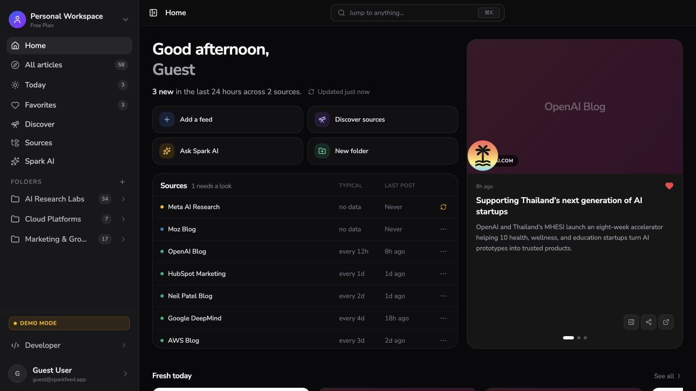

<div align="center">
  

# Sparkfeed

**A self-hosted reader and content-intelligence workspace for RSS and the rest of the web.**

[Website](https://sparkfeed.dev) · [Documentation](https://sparkfeed.dev/docs) · [Security](./.github/SECURITY.md)
</div>

Sparkfeed follows RSS and Atom feeds, monitors sites that do not publish a feed, and brings the results into shared workspaces. It combines focused reading with source discovery, website monitoring, Spark AI, sharing, a REST API, and MCP.



> Sparkfeed is preparing for its first public beta. APIs and interfaces can change before `1.0.0`.

## What Sparkfeed includes

- RSS and Atom subscriptions, plus website monitoring when no feed exists
- Home, Today, All articles, Favorites, source health, search, and a full-text reader
- Folders, shared workspaces, invitations, and public feed or folder links
- Spark AI with workspace-aware tools and saved chat history
- Source discovery and bulk URL or OPML input
- Workspace-scoped API keys for the REST API and MCP server

Community Edition includes the core product under `AGPL-3.0-only`. It supports up to 10 registered people and does not depend on Sparkable's hosted billing or platform-administration systems. Sparkable's commercial service sells managed hosting, operations, provider credits, support, and isolated deployments for larger organizations.

## Start with Docker Compose

Install Docker with the Compose plugin, then clone the repository:

```bash
git clone https://github.com/Sparkable-dev/sparkfeed.git
cd sparkfeed
cp .env.example .env
```

Set these values in `.env`:

```dotenv
POSTGRES_PASSWORD=replace-with-output-from-openssl-rand-hex-24
BETTER_AUTH_SECRET=replace-with-output-from-openssl-rand-base64-32
APP_URL=http://localhost:3000
```

Generate the two secrets with:

```bash
openssl rand -hex 24
openssl rand -base64 32
```

Start Sparkfeed and PostgreSQL:

```bash
docker compose up --build
```

Open [http://localhost:3000](http://localhost:3000). The first account becomes the instance owner. Later accounts need an invitation unless you set `ALLOW_REGISTRATION=true`.

The Compose file keeps PostgreSQL private to the Compose network. It stores database files in the `sparkfeed-postgres` volume and applies pending migrations before the application starts.

## Run from source

Install Bun, Node.js 22, and PostgreSQL 16 or later. Create a PostgreSQL database and set `DATABASE_URL` in `.env.local`.

```bash
bun install --frozen-lockfile
cp .env.example .env.local
bun run db:migrate
bun run dev
```

The development server listens on [http://localhost:3000](http://localhost:3000).

Do not use `db:push` for a deployed database. It changes the schema without updating the migration journal.

## Try demo mode

Demo mode uses an isolated local SQLite file. It does not require PostgreSQL, authentication, email, or an AI provider.

```bash
bun install --frozen-lockfile
VITE_DEMO_MODE=true DEMO_MODE=true bun run dev
```

Demo mode seeds sample content and blocks structural mutations. It does not share data with a Community installation.

## Configure Community access

Community Edition separates account registration from workspace creation.

| Variable                    | Default      | Behavior                                                                                              |
| --------------------------- | ------------ | ----------------------------------------------------------------------------------------------------- |
| `ALLOW_REGISTRATION`        | `false`      | The first account can register. Later accounts need an invitation. Set `true` to allow public signup. |
| `WORKSPACE_CREATION_POLICY` | `owner-only` | The first account can create workspaces. Set `all-users` to let every registered account create them. |

A valid invitation can create an account while public registration is closed. Community Edition supports up to 10 registered people, and each workspace can have up to 10 accepted members. Pending invitations do not consume a workspace membership until they are accepted.

## Configure optional services

Spark AI needs at least one operator-owned provider key:

- `OPENAI_API_KEY`
- `AI_GATEWAY_API_KEY`
- `OPENROUTER_API_KEY`

Invitation, verification, and password-reset email needs either Resend or SMTP. See [.env.example](./.env.example) for the complete environment reference.

REST and MCP use workspace-scoped API keys created in **Developer → API keys**. Community Edition does not apply hosted-plan checks to these capabilities.

## Repository layout

The application and its documentation live in this repository. The documentation site installs and deploys independently.

```text
sparkfeed/
├── src/                 TanStack Start application
├── drizzle/             PostgreSQL migrations
├── scripts/             Migration and validation scripts
├── docs/                Astro Starlight documentation
└── workers/docs-proxy/  Documentation proxy worker
```

The application uses React 19, TanStack Start, PostgreSQL, Drizzle ORM, Better Auth, Tailwind CSS, and the Vercel AI SDK. The documentation site uses Astro Starlight.

## Application commands

| Command                     | Purpose                                                       |
| --------------------------- | ------------------------------------------------------------- |
| `bun run dev`               | Start the development server on port 3000                     |
| `bun run build`             | Build `.output/server/index.mjs`                              |
| `bun run start`             | Start the built server                                        |
| `bun run db:migrate`        | Apply pending PostgreSQL migrations                           |
| `bun run db:auth-1-7:check` | Check Better Auth account identities before the 1.7 migration |
| `bun run lint`              | Run ESLint                                                    |
| `bun run typecheck`         | Check TypeScript without emitting files                       |
| `bun run test`              | Run Vitest                                                    |

## Back up and upgrade

Follow the [backup and restore guide](https://sparkfeed.dev/docs/advanced/export-and-backup/) before upgrading a live instance.

## Contribute and get help

- Read [CONTRIBUTING.md](./.github/CONTRIBUTING.md) before opening a pull request.
- Use [SUPPORT.md](./.github/SUPPORT.md) for community support expectations.
- Report security problems through [SECURITY.md](./.github/SECURITY.md), not a public issue.
- Read [GOVERNANCE.md](./.github/GOVERNANCE.md) for maintainer responsibilities.

## License and trademarks

Sparkfeed code is available under the [GNU Affero General Public License version 3](./LICENSE). If you modify Sparkfeed and let users interact with it over a network, provide those users with the corresponding source for your version.

The software license does not grant rights to the SparkFeed or Sparkable names and logos. Read [TRADEMARKS.md](./.github/TRADEMARKS.md) and [ASSETS.md](./.github/ASSETS.md) before redistributing branded or visual material.
